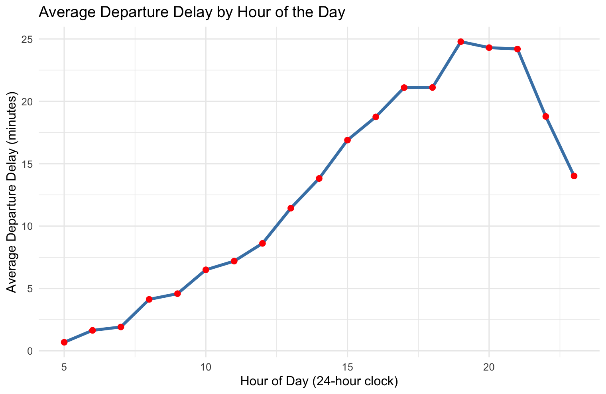
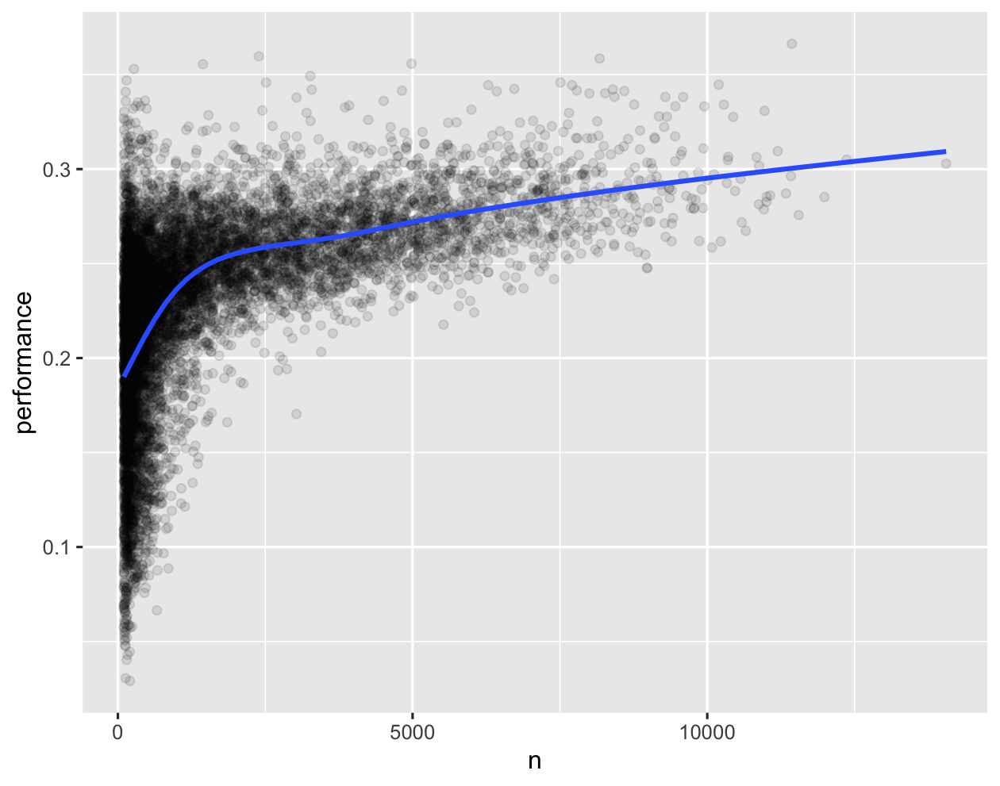

## Topic
In this session, we will discuss:  

* [4.1 dplyr verbs: select, mutate, filter, arrange](#41-dplyr-verbs-select-mutate-filter-arrange)
* [4.2 More dplyr verbs: group_by and summarise](#42-more-dplyr-verbs-group-by-and-summarise)
* [4.3 Further Reading](#43-murther-reading)

## keywords & Notes

This chapter introduces the `Tidyverse`, focusing on the `dplyr package`. While there are many ways to code in R, `Tidyverse` is taught here because it is intuitive for beginners. You should first study [Chapter 4 of Wickham & Grolemund’s book](https://r4ds.hadley.nz/data-transform.html) and then complete the `check-in exercises`. The notes use the pipe operator `%>%`, but you may also use the newer `|>` operator (explained in Chapter 4.4).

>[!IMPORTANT]
>Learn Tidyverse with dplyr, practice with the exercises, and choose the pipe style (%>% or |>) you prefer.

> The content below is adapted from Chapter 4 of Wickham & Grolemund’s book.”

#### 3  Data transformation

##### 3.1 Introduction

This chapter focuses on `data transformation` with `dplyr`. 

Since raw data is rarely in the right form for visualization, you’ll learn how to `create new variables, summarise data, rename variables, and reorder observations` to make analysis easier. 

The chapter introduces key tools for transforming `data frames`, starting with `row operations`, then `column operations`, and shows how to `combine steps with the pipe`. It also covers `grouped operations` and ends with a case study using `NYC flight data (2013)`. Later chapters will revisit these functions in more detail for specific data types.

###### 3.1.1 Prerequisites

This chapter introduces the `dplyr package` (part of the `tidyverse`), using the `nycflights13 dataset` and `ggplot2` for visualization. When loading `tidyverse`, you may see `conflicts`, meaning some `dplyr functions` replace `base R functions`. If you want the `base R version`, you can explicitly call it with `packagename::functionname()`.

>[!NOTE]
>Pro tip: If not installed, install tidyverse package first and nycflights13 package

```
#install packages

install.packages("tidyverse")
install.packages("nycflights13")
```
* Loading Packages

  ```
    library(nycflights13)
    library(tidyverse)
    
    #> ── Attaching core tidyverse packages ─────────────── tidyverse 2.0.0 ──
    #> ✔ dplyr     1.1.4     ✔ readr     2.1.5
    #> ✔ ggplot2   4.0.0     ✔ tibble    3.3.0
    #> ✔ lubridate 1.9.4     ✔ tidyr     1.3.1
    #> ✔ purrr     1.1.0     ✔ stringr   1.5.2
    #> ✔ forcats   1.0.1
    #> ── Conflicts ────────────────────────────────── tidyverse_conflicts() ──
    #> ✖ dplyr::filter() masks stats::filter()
    #> ✖ dplyr::lag()    masks stats::lag()

  ```

* Understanding Conflicts

  When you load `dplyr` (or the `tidyverse`), some of its functions have the same names as functions that already exist in `base R` (the default `R installation`).

  For example:

  * `filter()`

    * In base R (`stats::filter`) → it’s for filtering time series (e.g., moving averages).

    * In dplyr (`dplyr::filter`) → it’s for filtering rows in data frames.

  * `lag()`

    * In base R (`stats::lag`) → works with time series objects.

    * In dplyr (`dplyr::lag`) → shifts values in vectors or columns.

  When you load ``dplyr`, its versions `mask` or `replace` the base versions. That means if you just type `filter()`, R will use `dplyr’s function`, not the `base R` one.

  If you need the base version, call it with the package name:
  
  `General Syntax`: Whenever you want to be explicit about where a function comes from, use:
  
  ```
    packagename::functionname()

  ```
  For example:
  
  ```
  
    # dplyr filter - used for subsetting rows in data frames
    dplyr::filter(mtcars, cyl == 6)
    ## Returns only rows from 'mtcars' where cyl == 6
    
    # base R stats filter - used for time series, not data frames
    stats::filter(1:10, rep(1/3, 3))
    ## Applies a moving average filter on numbers 1 to 10

  
  ```

###### 3.1.1 nycflights13

* Exploring the flights dataset

  We’ll use `nycflights13::flights`, which contains   336,776 flights  departing New York City in 2013. The dataset is a tibble, a tidyverse-friendly version of a data frame.
  
* Viewing the dataset

  ```
  library(nycflights13)
  flights
  
  ```
  Output (first few rows only, since it’s a tibble):
  
  ```
    # A tibble: 336,776 × 19
     year month   day dep_time sched_dep_time dep_delay arr_time sched_arr_time
     <int> <int> <int>    <int>          <int>     <dbl>    <int>          <int>
   1  2013     1     1      517            515         2      830            819
   2  2013     1     1      533            529         4      850            830
   3  2013     1     1      542            540         2      923            850
     
  ```
  >[!NOTE]
  > Tibbles only print the first rows and as many columns as fit on the screen (unlike data frames that try to print everything).
  
* Exploring structure with `glimpse()`
  
  ```
  glimpse(flights)
  ```
  Output (shortened):
  
  ```
      Rows: 336,776
    Columns: 19
    $ year     <int> 2013, 2013, 2013, ...
    $ month    <int> 1, 1, 1, 1, ...
    $ dep_time <int> 517, 533, 542, ...
    $ dep_delay <dbl> 2, 4, 2, -1, ...
    $ carrier  <chr> "UA", "UA", "AA", ...
    $ time_hour <dttm> 2013-01-01 05:00:00, ...
  ```
  
  >[!TIP]
  >Here, variable types are shown:

    * `<int>` = integer

    * `<dbl>` = double (decimal numbers)

    * `<chr>` = character (text)

    * `<dttm`> = date-time

* Viewing options
  * `view(flights)` → opens an interactive spreadsheet in RStudio.

  * `print(flights, width = Inf)` → shows all columns in the console.

  * `glimpse(flights)` → 
  

>[!TIP]
>The flights tibble contains `336,776 rows` × `19 columns` about NYC flights in 2013. Tibbles print neatly, and you can inspect their structure with `view()`, `print(width=Inf)`, or `glimpse()`. Column types (int, dbl, chr, dttm) are key, since the operations you can apply depend on the type.


* `What is a tibble?` 
    * A `tibble` is a modern version of a data frame, created by the `tibble package` (part of the tidyverse).
  
    * It improves how data frames behave:
    
       * Printing → Only shows the first 10 rows and only the columns that fit on screen.
      
       * Column types → Always displayed (so you know if a column is integer, double, text, etc.).
      
       * Strings → Stay as character by default (unlike data.frame(), which may turn them into factors unless you tell it not to).
      
       * Subsetting → Tibbles are stricter, helping avoid confusing results.
       
    * How to create a tibble
      You can use the `tibble()` function:
      
      ```
        library(tibble)
    
        # Create a tibble
        tb <- tibble(
        ID = c("N198", "N805", "N333"),
        Age = c(30, 60, 26),
        Blood = c(0.4, 0.2, 0.6)
        )
    
        tb
      ```
      Output:
      
      ```
        # A tibble: 3 × 3
        ID      Age Blood
        <chr> <dbl> <dbl>
        1 N198     30   0.4
        2 N805     60   0.2
        3 N333     26   0.6
      ```
      >[!NOTE]
      > Notice how it prints neatly, shows types (`<chr>`, `<dbl>`), and      doesn’t overwhelm you with all rows.
      
      
    * Converting a data frame to tibble
    
      If you already know data.frame(), you can convert it:
      
      ```
        df <- data.frame(
          ID = c("N198","N805","N333"), Age = c(30,60,26), 
          Blood = c(0.4,0.2,0.6)
        )
  
        tb2 <- as_tibble(df)   # convert to tibble
        tb2
      ```
      
      > [!NOTE]
      > In short:A tibble is just a better data frame. You create it with `tibble()`, or by converting with `as_tibble()`. It prints nicely, keeps characters as characters, shows types, and avoids surprises when subsetting.
      
    * Tibble Subsetting Cheatsheet  

      | Operation                | Example                   | What it returns |
      |--------------------------|---------------------------|-----------------|
      | Select a column by name  | `tb["x"]`                 | A **tibble** (1 column) |
      | Extract column as vector | `tb[["x"]]` or `tb$x`     | A **vector** |
      | Select multiple columns  | `tb[c("x","y")]`          | A **tibble** with 2 columns |
      | Select rows & columns    | `tb[1:2, ]`               | First 2 rows (tibble) |
      | Access by row + column   | `tb[2, "x"]`              | A **tibble** (single cell, still tibble-like) |
      | Column does not exist    | `tb[ , "not_exist"]`      | ❌ **Error** (`Column not_exist not found`) |
      
      For example:
      
      ```
        library(tibble)
  
        tb <- tibble(x = 1:3, y = letters[1:3])
        
        tb["x"]       # tibble with 1 column
        tb[["x"]]     # numeric vector
        tb$x          # numeric vector
        tb[c("x","y")] # tibble with both columns
        tb[1:2, ]     # first two rows
        tb[2, "x"]    # tibble with 1 cell
      ```

  
  

###### 3.1.1 dplyr basics

The `dplyr package` has special functions (called `verbs`) that make it easier to work with data.

What all `dplyr verbs` have in common:

   1. The first input is always your data frame (like `flights`).
  
   2. You refer to columns directly by name (no quotes).
  
   3. The result is always a new data frame.
  
   4. You can combine steps using the pipe `|>` (read as “then”).
  


**The Pipe `|>`**

Think of `|>` as saying “then”.

```
  x |> f(y)         # same as f(x, y)
  x |> f(y) |> g(z) # same as g(f(x, y), z)
```

>[!IMPORTANT]
>This makes your code easier to read step by step.

Example with flights

Let’s say we want the *average arrival delay* of flights going to *Houston* (IAH), grouped by *day*.

```
  flights |> 
    filter(dest == "IAH") |>       # keep flights going to IAH
    group_by(year, month, day) |>  # group the data by date
    summarize(
      avg_delay = mean(arr_delay, na.rm = TRUE)  # calculate mean delay
    )
```

Output (first few rows):

```
  # A tibble: 365 × 4
     year month   day avg_delay
    <int> <int> <int>     <dbl>
  1  2013     1     1      7.33
  2  2013     1     2     -6.45
  3  2013     1     3      2.80
  ...
```

**Groups of dplyr verbs**

* Row verbs → pick rows

    * Example: `filter()` → choose rows that match a condition

* Column verbs → pick or change columns

    * Example: `select()` → choose specific columns

    * Example: `mutate()` → create new columns

* Group verbs → group data before summarizing

    * Example: `group_by()` + `summarize()`

* Table verbs → combine multiple datasets (you’ll learn later, e.g. `join())`

>[!TIP]
>In short:  
>dplyr verbs always start with your data.  
> * Use the pipe |> to say “then” and connect steps.  
> * Learn the main verbs: filter(), select(), mutate(), arrange(),   
> * summarize(), and group_by().  
 
      
##### 3.2 Rows

`Row` Verbs in `dplyr`

When working with data, sometimes you only want certain rows or you want to reorder them. The main dplyr verbs for rows are:

  1. `filter()` → keeps rows that match a condition (doesn’t change order).
  
  2. `arrange()` → changes the order of rows (doesn’t remove any).
  
  3. `distinct()` → keeps only unique rows (can also check uniqueness on specific columns).

>[!NOTE]
> These functions only affect rows, not columns (except `distinct()` if you tell it to).

###### 3.2.1 `filter()` – keep rows that match conditions
  
  `filter()` lets you keep only the rows that meet certain conditions.
  
  ```
    # Flights with departure delay greater than 120 minutes
    flights |> filter(dep_delay > 120)
  
  ```
  Output (first rows, tibble preview):
  
  ```
      # A tibble: 9,723 × 19
         year month day dep_time dep_delay arr_time arr_delay carrier ...
        2013     1   1      848       853     1001      851    MQ
        2013     1   1      957       144     1056      123    UA
    ...
  
  ```
  
  >[!NOTE]
  > You can use comparisons:
  > * `>` greater than
  > * `<` less than
  > * `>=` greater or equal
  > * `<=` less or equal
  > * `==` equal to
  > * `!=` not equal to
  
  
  Combine conditions
  
  ```
    # Flights on January 1
    flights |> filter(month == 1 & day == 1)
    
    # Flights in January OR February
    flights |> filter(month == 1 | month == 2)
    
    # Shortcut using %in%
    flights |> filter(month %in% c(1, 2))
  ```
  
  > [!NOTE]
  > `%in%` is a shortcut for checking multiple values.
  
  
  Saving results
  
  ```
  jan1 <- flights |> filter(month == 1 & day == 1)
  
  ```
  
  >[!CAUTION]
  > Common mistakes
  > Using `=` instead of `==`:
  
  ```
    flights |> filter(month = 1)  
    # Error: Did you mean `month == 1`?
  
  ```
  >[!CAUTION]
  > Writing conditions like English:
  
  ```
    flights |> filter(month == 1 | 2)
    # Doesn’t work as expected!
  
  ```


###### 3.2.3 `arrange()` – reorder rows

  `arrange()` reorders rows based on column values.
  
  ```
    # Sort flights by year, month, day, and departure time
    flights |> arrange(year, month, day, dep_time)
  
  ```
  `Earliest flights appear first.`
  
  ```
    # Sort by largest delay first
    flights |> arrange(desc(dep_delay))
  
  ```
  `Flights with longest delays at the top.`
  
  > [!NOTE]
  > `arrange()` only changes the order, not the number of rows.

###### 3.2.4 `distinct()` – unique rows

  `distinct()` removes duplicates.
  
  ```
    # Unique destinations
    flights |> distinct(dest)
    
    # Unique origin-destination pairs
    flights |> distinct(origin, dest)
  
  ```
  Example output:
  
  ```
    # A tibble: 224 × 2
      origin dest
      <chr>  <chr>
    1 EWR    IAH
    2 LGA    IAH
    3 JFK    MIA
    ...
  ```
  Keep all other columns with `.keep_all = TRUE`:
  
  ```
  flights |> distinct(origin, dest, .keep_all = TRUE)
  
  ```
  
  **Counting instead of distinct** 
  
  If you want to know how many times each pair occurs, use count():
  
  ```
    flights |> count(origin, dest, sort = TRUE)
  
  ```
  
  Example output:
  
  ```
    # A tibble: 224 × 3
      origin dest      n
      <chr>  <chr> <int>
    1 JFK    LAX   11262
    2 LGA    ATL   10263
    3 LGA    ORD    8857
    ...
  
  ```

>[!TIP]
> Summary
> * `filter()` → keep rows matching conditions (e.g., delays, dates).
> * `arrange()` → reorder rows (ascending or descending).
> * `distinct()` → keep only unique rows (optionally keep other columns).
> * `count()` → count how often each combination appears.


>[!TIP]
> In `filter(),` commas act like `&`.
> So `filter(a, b) = filter(a & b)`.
> If you want “or”, you must use `|` (there’s no comma shortcut for “or”).

```
  filter(dep_delay >= 60, (dep_delay - arr_delay) > 30) 
  # same as
  filter(dep_delay >= 60 & (dep_delay - arr_delay) > 30)

```

>[!TIP]
> `na.rm = TRUE` → "drop missing values before doing the calculation".
> Without it, many summary functions (`mean()`, `sum()`, `min()`, etc.) will give back NA if there’s even one missing value.

```
  flights |> 
    summarise(avg_delay = mean(dep_delay, na.rm = TRUE))
```


>[!TIP]
> `n()` is a special dplyr function that simply counts how many rows are in each group.
> * If no grouping, it counts all rows.
> * If grouped, it counts rows per group.
> * The left-hand side (n) is just the column name you want to give to the result.
> * The right-hand side (n()) is the function that does the counting.

Example without grouping:

```
  flights |> 
    summarise(n = n())

```
Output:
```
  # A tibble: 1 × 1
        n
    <int>
  1 336776

```

###### 3.2.5 Exercises

1. In a single pipeline for each condition, find all flights that meet the condition:

  * Had an arrival delay of two or more hours
  * Flew to Houston (IAH or HOU)
  * Were operated by United, American, or Delta
  * Departed in summer (July, August, and September)
  * Arrived more than two hours late but didn’t leave late
  * Were delayed by at least an hour, but made up over 30 minutes in flight
  
  **Solution**
  
  ```
  # Arrival delay of two or more hours
  flights |> filter(arr_delay >= 120)
  
  # Flew to Houston (IAH or HOU)
  flights |> filter(dest %in% c("IAH","HOU"))
  
  # Were operated by United, American, or Delta
  flights |> filter(carrier %in% c("UA", "AA", "DL"))
  
  # Departed in summer (July, August, and September)
  flights |> filter(month %in% 7:9)
  
  #Arrived more than two hours late but didn’t leave late
  flights |> filter(arr_delay > 120 & dep_delay == 0)
  
  # Were delayed by at least an hour, but made up over 30 minutes in flight
  filter(dep_delay >= 60, (dep_delay - arr_delay) > 30)
  
  ```
  
2. Sort flights to find the flights with the longest departure delays. Find the flights that left earliest in the morning.
  
  **Solution**
  ```
  flights |> 
  arrange(desc(dep_delay)) |> 
  head()
  ```
  
3. Sort flights to find the fastest flights. (Hint: Try including a math calculation inside of your function.)
 
 **Solution**
  ```
    flights |>
      filter(!is.na(air_time), air_time > 0) |>       # keep valid rows
      arrange(desc(distance / air_time * 60)) |>      # compute mph inside arrange
      head(10)
  
  ```
  
  >[!TIP]
  > What’s happening on above solution?
  > * `distance / air_time * 60` is the speed in miles per hour.
  > * `arrange(desc(...))` sorts from fastest to slowest.
  > * `head(10)` just shows the first 10 fastest flights.
  > * speed = distance / time
  
4. Was there a flight on every day of 2013?

  **Solution**
  ```
  flights |>
    distinct(year, day, month) |>
    summarise(n_days=n())
  
  ```

5. Which flights traveled the farthest distance? Which traveled the least distance?

  **Solution**
  ```
    # Farthest flight(s)
    flights |>
      filter(distance == max(distance, na.rm = TRUE)) |>
      select(year, month, day, carrier, flight, origin, dest, distance)
    
    # Shortest flight(s)
    flights |>
      filter(distance == min(distance, na.rm = TRUE)) |>
      select(year, month, day, carrier, flight, origin, dest, distance)
  
  ```
  >[!TIP]
  > What happens above: 
  > * `max(distance, na.rm = TRUE)` → finds the longest distance, ignoring any missing values.  
  > * `min(distance, na.rm = TRUE)` → finds the shortest distance.  
  > * `filter()` → keeps only rows that match those values.  
  > * `select()` → just displays useful columns so the output is clear.  
  
  
6. Does it matter what order you used `filter()` and `arrange()` if you’re using both? Why/why not? Think about the results and how much work the functions would have to do.

  **Solution**  
  
  **Yes**, the results will be the same, but the amount of work R does depends on the order you use:  
    * `filter()` first: Narrow down the dataset to only the rows you need, then sort them.       
      ✅ Faster and more efficient.    
    * `arrange()` first: Sort the entire dataset (even rows you’ll later throw away), then filter.   
      ❌ Slower and unnecessary extra work.  
 
    
  > [!IMPORTANT]
  > * The final result looks the same.  
  > * But filtering first is better because R only sorts the smaller dataset, not the whole thing.
  
  >[!TIP]
  >Rule of thumb: Filter early, arrange later.
  
##### 3.3 Columns

There are four main verbs in `dplyr` that work with columns (without changing rows):  

  * `mutate()` → create new columns.
  
  * `select()` → choose which columns to keep.
  
  * `rename()` → rename columns.
  
  * `relocate()` → move columns around.
  
###### 3.3.1 mutate() – Create new columns

  `mutate()` adds new variables that are calculated from existing ones.
  
  ```
    flights |> 
      mutate(
        gain = dep_delay - arr_delay,        # time made up in air
        speed = distance / air_time * 60     # flight speed in mph
      )
  
  ```
  >[!NOTE]
  > Adds gain and speed as new columns.
  
  **You can control where new columns appear:**
  ```
    flights |> 
    mutate(gain = dep_delay - arr_delay, .before = 1)   # add before first column

  ```
  
  **Or only keep the columns you used:**
  
  >[!TIP]
  > What .keep = "used" means
  > * Normally, when you use `mutate()`, your new columns are added to the existing dataset — so you still see all the original columns.
  > * But sometimes you only want to see the columns that were involved in the calculation (to keep things clean).
  > * That’s what `.keep = "used"` does — it tells R:
  > * “Only keep the columns I used or created in this mutate step.”
  
  ```
    flights |> 
    mutate(
      gain = dep_delay - arr_delay,
      hours = air_time / 60,
      gain_per_hour = gain / hours,
      .keep = "used"
    )

  ```
  This code will return a tibble with only these columns:
  
  ```
    dep_delay, arr_delay, air_time, gain, hours, gain_per_hour

  ```
  >[!NOTE]
  > * Instead of showing all 19 original columns from flights.
  > * ✅ Useful when you just want to focus on your calculated results.
  
  >[!IMPORTANT]
  > * ⚠️ Remember: unless you assign with `<-`, the new columns won’t be saved.
  > * When you run a command like the one above, R prints the result, but it doesn’t save it anywhere.
  > * That means if you type `flights` again later, it will still be the old version — your new columns are gone.
  > * To save your new data frame, you must assign it to an object using `<-`:
  
  ```
    flights_summary <- flights |> 
    mutate(
      gain = dep_delay - arr_delay,
      hours = air_time / 60,
      gain_per_hour = gain / hours,
      .keep = "used"
  )

  ```
  Now, `flights_summary` keeps those new columns and you can use it later.
  
  >[!TIP]
  > * `.keep = "used"` → keeps only columns used or created.
  > * `<-` → saves your result to a new dataset (otherwise it disappears after printing).
  
  
###### 3.3.2 `select()` – Pick columns
  **`select()` helps you focus on specific columns.**
  ```
    flights |> select(year, month, day)          # pick specific columns
    flights |> select(year:day)                  # pick a range of columns
    flights |> select(!year:day)                 # drop a range of columns
    flights |> select(where(is.character))       # keep only character columns

  ```
  **You can also rename while selecting:**
  
  You can rename columns directly inside `select()` by using `=`
  
  – the new name goes on the `left`, and the old name on the `right`.
  
  ```
    flights |> select(tail_num = tailnum)
  ```
  
  This keeps the column tailnum but shows it as tail_num in the output.
    
  **Check columns names**
  
  ```
    colnames(flights)

  ```
  
  **Helper Functions in `select()`**
  
  | Function              | What It Does                                   | Example                       | Result                         |
| --------------------- | ---------------------------------------------- | ----------------------------- | ------------------------------ |
| `starts_with("abc")`  | Selects columns that **start with** `"abc"`    | `select(starts_with("dep"))`  | Picks `dep_time`, `dep_delay`  |
| `ends_with("xyz")`    | Selects columns that **end with** `"xyz"`      | `select(ends_with("time"))`   | Picks `dep_time`, `arr_time`   |
| `contains("ijk")`     | Selects columns that **contain** `"ijk"`       | `select(contains("delay"))`   | Picks `dep_delay`, `arr_delay` |
| `num_range("x", 1:3)` | Selects numbered columns like `x1`, `x2`, `x3` | `select(num_range("x", 1:3))` | Picks `x1`, `x2`, `x3`         |


    
    
  
###### 3.3.2 `rename()` – Rename columns
  ```
    flights |> rename(tail_num = tailnum)
  ```
  >[!NOTE]
  > * Same as `select()`, but it doesn’t drop any columns.
  
  **Cleaning Column Names Automatically**
  
  Sometimes your dataset has messy or inconsistent column names, like this:
  
  ```
    data <- data.frame(
    "Flight Number" = c(1, 2),
    "Departure Time" = c("10:00", "12:00"),
    "Arrival-Time" = c("11:30", "13:30")
  )
  
  colnames(data)
  ## [1] "Flight Number" "Departure Time" "Arrival-Time"

  ```
  
  Typing those long names with spaces or symbols is annoying 😩.
  
  You can fix them automatically using the `janitor` package:
  
  ```
    library(janitor)
    
    clean_data <- data |> clean_names()
    colnames(clean_data)
    ## [1] "flight_number" "departure_time" "arrival_time"

  ```
  ✅ Now all column names are lowercase, use underscores instead of spaces, and are easy to type.
  
  >[!TIP]
  > * Use `janitor::clean_names()` to automatically tidy up column names —
it converts them into clean, consistent, and R-friendly names.

###### 3.3.4 `relocate()` – Move columns
  **Reorder columns to make the dataset easier to read.**
  ```
    flights |> relocate(time_hour, air_time)   # move to the front
  ```
  **You can also move columns relative to others:**
  ```
    flights |> relocate(year:dep_time, .after = time_hour)   # move after time_hour
    flights |> relocate(starts_with("arr"), .before = dep_time) # move before dep_time
  ```
###### 3.3.5 Exercises
1. Compare `dep_time`, `sched_dep_time`, and `dep_delay`. How would you expect those three numbers to be related?

  **Solution**
  
  __The three variables__
  
  | Column           | Meaning                                                                                 |
  | ---------------- | --------------------------------------------------------------------------------------- |
  | `dep_time`       | The **actual departure time** of the flight                                             |
  | `sched_dep_time` | The **scheduled (planned)** departure time                                              |
  | `dep_delay`      | The **difference** (in minutes) between the two — how early or late the flight departed |
  

  
  *How they are related*
  
  You can think of it as a simple relationship:
  ```
    dep_delay = dep_time - sched_dep_time
  ```
  
  (but measured in minutes, not clock time).
  
  
  >[!NOTE]
  > What to expect
  > * If a flight left on time, then
  >   `dep_delay = 0`
  > * If a flight left late, then
  >  `dep_delay` is positive (`dep_time` > `sched_dep_time`).
  > * If a flight left early, then
  >  `dep_delay` is negative (`dep_time` > `sched_dep_time`).
  
  **Example in R**
  ```
  flights |>
    select(dep_time, sched_dep_time, dep_delay) |>
    head(10)

  ```
  Example output:
  
  ```
    # A tibble: 10 × 3
     dep_time sched_dep_time dep_delay
        <int>          <int>     <dbl>
   1      517            515         2
   2      533            529         4
   3      542            540         2
   4      544            545        -1
   5      554            600        -6
   6      554            558        -4
   7      555            600        -5
   8      557            600        -3
   9      557            600        -3
  10      558            600        -2

  ```
  >[!NOTE]
  > * You can see that when `dep_time` is later than `sched_dep_time`,
  > * `dep_delay` is positive — meaning the flight was late.
  > * When it’s earlier, the delay is negative — meaning it left early.
  
  >[!TIP]
  > * `dep_time` = actual departure time
  > * `sched_dep_time` = planned departure time
  > * `dep_delay` = the difference (in minutes) between them
  > → A positive value = left late, negative = left early, zero = on time.


2. Brainstorm as many ways as possible to select `dep_time`, `dep_delay`, `arr_time`, and `arr_delay` from flights.
  
  ```
  # Easiest (name them directly)
  flights |> select(dep_time, dep_delay, arr_time, arr_delay)
  
  #Using a vector of names (handy if you reuse it)
  cols <- c("dep_time", "dep_delay", "arr_time", "arr_delay")
  flights |> select(all_of(cols))    # strict: errors if a name is missing
  flights |> select(any_of(cols))    # forgiving: ignores missing names
  
  # Pattern helpers (tidyselect)
  #By prefix (safe & concise):
  flights |> select(starts_with("dep") | starts_with("arr"))
  
  # By exact regex pattern (most precise):
  flights |> select(matches("^(dep|arr)_(time|delay)$"))
  
  # Base R equivalents (no dplyr)
  #Direct column name vector:
  flights[,c("dep_time", "dep_delay", "arr_time", "arr_delay")]
  
  # With a regex on names:
  flights[, grepl("^(dep|arr)_(time|delay)$", names(flights))]
  
  # Using subset() (base R helper):
  subset(flights, select =c(dep_time, dep_delay, arr_time, arr_delay))

  ```
  >[!TIP]
  > Rule of thumb:
  > * Use exact names for clarity.
  > * Use `starts_with()` or `matches()` when patterns make the code shorter and safer.
  > * Use `all_of()` / `any_of()` when selecting from a dynamic list of names.
  
3. What happens if you specify the name of the same variable multiple times in a select() call?

  **Solution**
  If you use `select()` and repeat the same column name multiple times,
  
  👉 `R` will only keep one copy of that column in the result.

  In other words — duplicates are ignored automatically.
  
  Example
  
  Let’s try it with the flights dataset:
  
  ```
  flights |> 
  select(year, month, day, dep_time, dep_time)

  ```
  ✅ Output (simplified):
  
  ```
    # A tibble: 336,776 × 4
      year month   day dep_time
     <int> <int> <int>    <int>
   1  2013     1     1      517
   2  2013     1     1      533
   3  2013     1     1      542
   4  2013     1     1      544
   5  2013     1     1      554

  ```
  >[!NOTE]
  > Notice that `dep_time` only appears once, even though we wrote it twice.
  
  💡 Why?
  `select()` always returns a unique set of column names —   
  so repeating a column doesn’t add extra copies or change the result.
  
  
4. What does the `any_of()` function do? Why might it be helpful in conjunction with this vector?

```
variables <- c("year", "month", "day", "dep_delay", "arr_delay")
```
  **Solution**
  
  What `any_of()` does
  
  `any_of()` is used inside `select()` (or similar functions) to safely select columns based on a list (vector) of names.
  
  If some names in that list don’t actually exist in the dataset,
  👉 `any_of()` just ignores them, instead of giving an error.
  
  Example
  
  You want to select those columns from the flights data:
  
  ```
  flights |> select(any_of(variables))

  ```
  ✅ Output (first few rows):
  
  ```
    # A tibble: 336,776 × 5
      year month   day dep_delay arr_delay
     <int> <int> <int>     <dbl>     <dbl>
   1  2013     1     1         2        11
   2  2013     1     1         4        20
   3  2013     1     1         2        33
   4  2013     1     1        -1       -18
   5  2013     1     1        -6       -25

  ```
  **Why it’s useful**
  
  If one of the names in your vector doesn’t exist — for example:
  
  ```
    variables <- c("year", "month", "day", "dep_delay", "arr_delay", "not_exist")

  ```
  then:
  
  * Using `all_of()` will cause an error ❌
  * Using `any_of()` will ignore the missing name and still work ✅

  ```
  # This works fine, ignoring "not_exist"
  flights |> select(any_of(variables))

  ```

5. Does the result of running the following code surprise you? How do the select helpers deal with upper and lower case by default? How can you change that default?

```
  flights |> select(contains("TIME"))

```
  **Solution**
  
  We’re using `select(contains("TIME"))` to find all columns that contain the word “TIME” in their names.
  
  ```
  flights |> select(contains("TIME"))
  ```
  
  **What happens?**
  
  By default, `contains()` in `dplyr` is not case-sensitive —  
  meaning it ignores uppercase or lowercase differences.
  
  So, even though the dataset has columns like `dep_time`, `arr_time`, and `sched_dep_time` (all lowercase), 
  
  `contains("TIME")` will still match them ✅.
  
  ✅ Output (simplified)
  
  ```
    # A tibble: 336,776 × 4
     dep_time sched_dep_time arr_time sched_arr_time
        <int>          <int>    <int>          <int>
   1      517            515      830            819
   2      533            529      850            830
   3      542            540      923            850
   4      544            545     1004           1022

  ```
  >[!NOTE]
  > * So even though we used uppercase "TIME",
  > * it found all the lowercase columns that contain “time”.
  
  **How to make it case-sensitive**
  
  If you want to match exactly how the column name is written
  
  (e.g., match only uppercase “TIME”), use the argument `ignore.case = FALSE`.
  
  ```
   flights |> select(contains("TIME", ignore.case = FALSE))
  ```
  ✅ Output:
  
  ```
  # A tibble: 336,776 × 0
  # ℹ Use `print(n = ...)` to see more rows

  ```
  
  >[!NOTE]
  > By default, `select()` helper functions like `contains()`, `starts_with()`, and `ends_with()` ignore uppercase/lowercase differences.
You can change that using `ignore.case = FALSE` if you want exact case matching.
  
  
6. Rename `air_time` to `air_time_min` to indicate units of measurement and move it to the beginning of the data frame.

  **Solution**
  We can do both tasks at once using `rename()` and `relocate()` from `dplyr`.
  ```

  flights |> 
    rename(air_time_min = air_time) |>     # Rename the column
    relocate(air_time_min, .before = 1)    # Move it to the first column
  ```
  
  **Output (simplified)**
  
  ```
    # A tibble: 336,776 × 19
     air_time_min  year month   day dep_time sched_dep_time dep_delay arr_time
            <dbl> <int> <int> <int>    <int>          <int>     <dbl>    <int>
   1          227  2013     1     1      517            515         2      830
   2          227  2013     1     1      533            529         4      850
   3          160  2013     1     1      542            540         2      923
   4          183  2013     1     1      544            545        -1     1004

  ```
  >[!TIP]
  > You can also move the column by name instead of position:
  
  ```
  flights |> 
  rename(air_time_min = air_time) |> 
  relocate(air_time_min, .before = year)

  ```
  Both give the same result. ✅
  
7. Why doesn’t the following work, and what does the error mean?

```
  flights |> 
    select(tailnum) |> 
    arrange(arr_delay)
  #> Error in `arrange()`:
  #> ℹ In argument: `..1 = arr_delay`.
  #> Caused by error:
  #> ! object 'arr_delay' not found
```
  
  **Solution**
  
  💥 What Happened
  1. In the first step,
  
  ```
    select(tailnum)
  ```
  you kept only one column — `tailnum`.
  
  2. Then, you tried to sort the data by arr_delay:
  
  ```
  arrange(arr_delay)

  ```
  But since `arr_delay` was removed in the first step,  
  R doesn’t know what it is — it’s not in your data anymore! 
  
  ✅ **The Fix**
  You have two main options depending on what you want:
  
  **Option 1: Keep both columns**
  If you want to arrange by `arr_delay`, keep it in the data:
  
  ```
    flights |> 
    select(tailnum, arr_delay) |> 
    arrange(arr_delay)

  ```
  💡 Now R knows what `arr_delay` is — because it’s still in your dataset!
  
  **Option 2: Arrange first, then select**
  If you only want to see `tailnum` but sort by delay:
  
  ```
    flights |> 
    arrange(arr_delay) |> 
    select(tailnum)

  ```
  ✅ This works because you sort before removing arr_delay.
  
  >[!IMPORTANT]
  > Key Takeaway
  > * You can’t arrange (or filter) by a column that no longer exists in your dataset.
  > * So, the order of functions matters when chaining with the pipe |>.
  

##### 3.4 The pipe 
  
  Chain small steps with the `pipe`
  
  The pipe `(|>)` lets you write data steps in the order you think:  
  take `data` then `filter` then `create a column` then `pick columns` then `sort.`
  
  ```
  flights |>
    filter(dest == "IAH") |>                          # keep flights to IAH
    mutate(speed = distance / air_time * 60) |>       # mph = miles / (min/60)
    select(year:day, dep_time, carrier, flight, speed) |> 
    arrange(desc(speed))                               # fastest first
  ```
  
  Example output (first rows):
  
  ```
    # A tibble: 7,198 × 7
     year month   day dep_time carrier flight speed
    <int> <int> <int>    <int> <chr>    <int> <dbl>
  1  2013     7     9      707 UA         226  522.
  2  2013     8    27     1850 UA        1128  521.
  3  2013     8    28      902 UA        1711  519.
  ...

  ```
  `Why this is nice`: the verb starts each line, so it reads like a recipe.
  
  **Without the pipe (harder to read)**
  
  a) **Nested calls (inside-inside-inside)**
  
  ```
    arrange(
    select(
      mutate(
        filter(flights, dest == "IAH"),
        speed = distance / air_time * 60
      ),
      year:day, dep_time, carrier, flight, speed
    ),
    desc(speed)
  )

  ```
  
  b) **Many temporary objects**
  
  ```
  flights1 <- filter(flights, dest == "IAH")
  flights2 <- mutate(flights1, speed = distance / air_time * 60)
  flights3 <- select(flights2, year:day, dep_time, carrier, flight, speed)
  arrange(flights3, desc(speed))

  ```
  Both work, but the pipe is usually easier to write and read.
  
  >[!TIP]
  >How to insert the pipe quickly
  > * RStudio shortcut: Ctrl/Cmd + Shift + M
  
  >[!TIP]
  > If your shortcut still inserts `%>%`, here’s how to switch it:
  > * Go to Tools ▸ Global Options
  > * Select Code ▸ Editing
  > * Under “Use native pipe operator when inserting with Ctrl+Shift+M”,
  > * ✅ Check the box that says Use native pipe operator (|>) instead of %>%
 > * Click Apply or OK
 
 `%>%` vs `|>` (which pipe?)
 
  You’ll see two pipes in R code:

  * Base pipe `|>` (recommended): built into R (since 4.1), simple, always available.

  * magrittr pipe `%>%` (from magrittr / tidyverse): very common in older tutorials.

  Both behave the same in simple cases:
  
  ```
  mtcars %>%                      # magrittr pipe
  group_by(cyl) %>%
  summarize(n = n())
  
  mtcars |>                       # base pipe
  group_by(cyl) |>
  summarize(n = n())

  ```
  
  >[!NOTE]
  > Recommendation: Learn `|>` for modern/base R; understand `%>%` because you’ll see it in lots of examples.
  
##### 3.3 Groups
So far, you’ve learned how to manipulate rows and columns.

Now, you’ll learn how to analyze data by groups — for example, finding the average delay per month or the longest flight per destination.

The main functions are:

The main functions are:

  * `group_by()` → divides data into groups
  
  * `summarise()` → calculates summary values for each group
  
  * `slice_*()` → extracts specific rows within each group
  
  * `ungroup()` → removes grouping
  
  * `.by` → an easier alternative for temporary grouping


  ###### 3.5.1 group_by()
  
  Use `group_by()` to split your dataset into smaller groups before applying another function.
  
  ```
    flights |> 
    group_by(month)

  ```
  >[!NOTE]
  > * The data doesn’t change — it just becomes grouped.
  > * You’ll see something like this in the output:
  
  ```
    # Groups: month [12]

  ```
  >[!IMPORTANT]
  > That means R will now treat each month as a separate group when doing calculations.
  
  ###### 3.5.2 `summarise()`
  
  `summarise()` calculates summary values (like mean, count, etc.) for each group.

  Example — find the average departure delay per month:
  
  ```
    flights |> 
    group_by(month) |> 
    summarize(avg_delay = mean(dep_delay, na.rm = TRUE))

  ```
  
  Output (simplified):
  
  ```
    # A tibble: 12 × 2
     month avg_delay
     <int>     <dbl>
  1      1      10.0
  2      2      10.8
  ...

  ```
  >[!NOTE]
  > `na.rm = TRUE` tells R to ignore missing values (NA).
  
  You can also get the number of flights per month:
  
  ```
    flights |> 
    group_by(month) |> 
    summarise(
      avg_delay = mean(dep_delay, na.rm = TRUE),
      n = n()   # counts rows in each group
    )

  ```
  
  >[!TIP]
  > After using `summarise()`, your dataset shrinks —
  > you lose the original columns unless you explicitly keep them.
  > Think of summarise() as:
  > * “Take all these rows, calculate something new, and return only the results.”

  
  ###### 3.5.3 The`slice_*()` Family
  
  These functions help you extract specific rows within each group:
  
  | Function              | Description                                           |
| --------------------- | ----------------------------------------------------- |
| `slice_head(n = 1)`   | Selects the **first row** in each group               |
| `slice_tail(n = 1)`   | Selects the **last row** in each group                |
| `slice_min(x, n = 1)` | Selects the row(s) with the **smallest** value of `x` |
| `slice_max(x, n = 1)` | Selects the row(s) with the **largest** value of `x`  |
| `slice_sample(n = 1)` | Selects **random row(s)** from each group             |

  Example — find the most delayed flight for each destination:
  
  ```
    flights |> 
    group_by(dest) |> 
    slice_max(arr_delay, n = 1) |> 
    relocate(dest)
  ```
  >[!IMPORTANT]
  > ⚠️ Sometimes you’ll see more than one row per group if multiple flights have the same delay.
  > Add `with_ties = FALSE` to keep only one.
  
  >[!TIP]
  > `n = 1` means:
  > * Select one row per group.
  
  **Example 1 — Basic dataset**
  
  Let’s create a small dataset:
  
  ```

  df <- tibble(
    group = c("A", "A", "A", "B", "B", "C", "C", "C"),
    value = c(10, 5, 8, 3, 9, 2, 7, 6)
  )

  ```
  **Example 2 — Using slice_head(n = 1)**
  
  ```
    df |>
    group_by(group) |>
    slice_head(n = 1)
  ```
  ✅ Meaning:
  “From each group (A, B, C), take the first row only.”
  
  🧾 Output:
  
  ```
    # A tibble: 3 × 2
  # Groups:   group [3]
    group value
    <chr> <dbl>
  1 A        10
  2 B         3
  3 C         2

  ```
  
  **Example 3 — Using n = 2**
  
  ```
    df |>
    group_by(group) |>
    slice_head(n = 2)
  ```
  ✅ Meaning:
  “From each group, take the first two rows.”
  
  🧾 Output:
  ```
   # A tibble: 6 × 2
  # Groups:   group [3]
    group value
    <chr> <dbl>
  1 A        10
  2 A         5
  3 B         3
  4 B         9
  5 C         2
  6 C         7

  ```
  
  >[!TIP]
  > Extra Tip
  > * Instead of `n =`, you can also use `prop =` to take a proportion of each group.
  
  Example:
  
  ```
    df |> 
    group_by(group) |> 
    slice_sample(prop = 0.5)

  ```
  ✅ Meaning:
  
  “Take 50% of rows from each group (randomly).”
  
  
  
  ###### 3.5.4 Grouping by Multiple Variables
  
  You can group by more than one variable, like `year`, `month`, and `day`:
  
  ```
    daily <- flights |> group_by(year, month, day)
  ```
  
  Then summarize:
  
  ```
    daily |> 
    summarise(
      n = n(),
      .groups = "drop_last"  # keeps grouping by year and month only
    )
  ```
  >[!NOTE]
  > Other `.groups` options:
  > * "drop" → remove all grouping
  > * "keep" → keep all original groups
  
  >[!TIP]
  > You can confirm if a dataset is grouped with:
  
  ```
    group_vars(data)

  ```
  
  ###### 3.5.5 `ungroup()`
  
  Removes grouping completely:
  
  ```
    daily |> ungroup()
  ```
  Now every operation works on the whole dataset again, not per group.
  
  ```
    daily |> 
    ungroup() |> 
    summarise(
      avg_delay = mean(dep_delay, na.rm = TRUE),
      flights = n()
    )

  ```
  Output:
  
  ```
    # A tibble: 1 × 2
    avg_delay flights
        <dbl>   <int>
  1      12.6  336776

  ```
  
  > [!IMPORTANT]
  > What’s actually happening
  > 1. `ungroup()` removes all grouping from the data —
  >  so now R treats the entire dataset as one big group.
  > 2. summarise() always reduces the data —
  >. it creates one row per group.
  
  ###### 3.5.6 .by (New in dplyr 1.1.0)
  
  Instead of using group_by(), you can group directly inside a function with .by.
  
  Example:
  
  ```
    flights |> 
    summarise(
      delay = mean(dep_delay, na.rm = TRUE),
      n = n(),
      .by = month
    )

  ```
  
  >[!TIP]
  > In short:
  > * `.by` groups only during summarise,
  > * and once that summarise finishes, the result is no longer grouped.
  
  Or with multiple variables:
  
  ```
    flights |> 
    summarise(
      delay = mean(dep_delay, na.rm = TRUE),
      n = n(),
      .by = c(origin, dest)
    )

  
  ```
  ✅ It’s simpler because you don’t need to remember to `ungroup()` afterward.
  
  >[!TIP] 
  > Summary
  
  | Function      | Purpose                                      |
| ------------- | -------------------------------------------- |
| `group_by()`  | Create groups for analysis                   |
| `summarise()` | Calculate summary statistics per group       |
| `slice_*()`   | Extract specific rows from each group        |
| `ungroup()`   | Remove grouping after summarizing or slicing |
| `.by`         | Temporarily group within a single operation  |

###### 3.5.7 Exercises

1. Which carrier has the worst average delays? Challenge: can you disentangle the effects of bad airports vs. bad carriers? Why/why not? (Hint: think about flights |> group_by(carrier, dest) |> summarize(n()))
  
  **Solution**
  
  Question Recap
  > Which carrier has the worst average delays?
  > Challenge: can you tell if it’s because the carrier is bad or because it flies to problematic airports?
  
  ✅ Step 1: Find the average delay per carrier
  
  We’ll start simple — calculate the average departure delay for each carrier.
  
  ```
  flights |>
    group_by(carrier) |> 
    summarise(
      avg_dep_delay = mean(dep_delay, na.rm = TRUE)
    ) |>
    arrange(desc(avg_dep_delay)) # sort from worst to best

  ```
  🧾 Example Output
  ```
    | carrier | avg_dep_delay |
  | ------- | ------------- |
  | F9      | 20.2          |
  | EV      | 19.9          |
  | YV      | 18.4          |
  | OO      | 16.6          |
  | MQ      | 15.6          |
  | ...     | ...           |

  ```
  🟡 Interpretation:
  The higher the number, the worse the carrier’s average delay.  
  In this example, F9 (Frontier Airlines) has the worst average delay.
  
  ✅ Step 2: Think deeper — is the carrier really the problem?
  
  You might wonder:
  
  > “Maybe some airlines have bad delays not because they’re bad — but because they fly to airports that often cause delays.”
  
  That’s an excellent observation 👏
  
  To explore that, we can check average delays by both carrier and destination.
  
  ```
  flights |>
  group_by(carrier, dest) |>
  summarise(
    avg_delay = mean(dep_delay, na.rm = TRUE),
    flights = n()
  ) |>
  arrange(desc(avg_delay))

  ```
  
  🧾 Example Output
  
  ```
       carrier dest  avg_delay flights
     <chr>   <chr>     <dbl>   <int>
   1 UA      STL        77.5       2
   2 OO      ORD        67         1
   3 OO      DTW        61         2
   4 UA      RDU        60         1
   5 EV      PBI        48.7       6
   6 EV      TYS        41.8     323
   7 EV      CAE        36.7     113
   8 EV      TUL        34.9     315
   9 9E      BGR        34         1
  10 WN      MSY        33.4     298

  ```
  
  🧩 Step 3: Interpretation

  Now you can see:
  
  * Some destinations (like STL or ORD) may cause more delays overall,
  regardless of which carrier flies there.
  
  * Some carriers (like F9 or EV) might still perform worse even across multiple airports —
  showing it could be a carrier issue.
  
  So, to answer the “why” part:
  > ❌ You cannot completely disentangle whether delays are caused by bad carriers or bad airports just from this dataset.
  > ✅ You would need more information — like weather data, airport congestion, and flight routes — to tell who’s truly responsible.

2. Find the flights that are most delayed upon departure from each destination.  

  **Solution**
  
  Question
  > Find the flights that are most delayed upon departure from each destination.
  
  That means:
  For each destination (`dest`), we want to look at all the flights going there, and then pick the one flight with the largest `dep_delay` (departure delay).
  
  ✅ Step 1: Group flights by destination
  We use `group_by(dest)` to tell R that we want to analyze each destination separately.
  
  ```
  flights |>
    group_by(dest)

  ```
  This doesn’t change the data yet — it just tells R:
  🗂 “Whenever you summarise or slice next, do it for each destination.”
  
  ✅ Step 2: Select the most delayed flight per group
  
  We use slice_max() to pick the flight(s) with the largest departure delay (dep_delay) within each group.
  
  ```
  flights |>
    group_by(dest) |>
    slice_max(dep_delay, n = 1) 

  ```
  🧾 Output (shortened example)
  
  ```
    dest   year month   day dep_time dep_delay carrier flight
    <chr> <int> <int> <int>    <int>     <dbl> <chr>    <int>
  1 ABQ    2013    12    14     2223       142 B6          65
  2 ACK    2013     7    23     1139       219 B6        1491
  3 ALB    2013     1    25      123       323 EV        4309
  4 ANC    2013     8    17     1740        75 UA         887
  
  ```
  🟡 Each row shows the most delayed flight for that destination.
  
  ✅ Step 3: Clean up the output
  
  You can move the destination column to the front for easier viewing using relocate():
  
  ```
      dest   year month   day dep_time dep_delay carrier flight
    <chr> <int> <int> <int>    <int>     <dbl> <chr>    <int>
  1 ABQ    2013    12    14     2223       142 B6          65
  2 ACK    2013     7    23     1139       219 B6        1491
  3 ALB    2013     1    25      123       323 EV        4309
  4 ANC    2013     8    17     1740        75 UA         887
  
  ```
  
  ✅ Step 4 (optional): Handle ties

  Sometimes, more than one flight may have the same biggest delay at a destination.
  By default, `slice_max()` keeps all tied rows.
  
  If you only want one row per destination, add:
  
  ```
  flights |>
  group_by(dest) |>
  slice_max(dep_delay, n = 1, with_ties = FALSE)

  ```
3. How do delays vary over the course of the day? Illustrate your answer with a plot.

  **Solution**
  
  Question  
  > How do delays vary over the course of the day? Illustrate your answer with a plot.
  
  This means we want to see whether flights departing early in the morning, midday, or late at night tend to have more or fewer delays.
  
  ✅ Step 1: Summarize the average delay per hour
  
  In the flights dataset, we already have a variable called hour, which shows the scheduled departure time (for example 5 AM = 5, 11 PM = 23).
We’ll group the data by hour and then calculate the average departure delay for each hour.

  ```
  avg_delay_by_hour <- flights |>
    group_by(hour) |>
    summarise(
      avg_dep_delay = mean(dep_delay, na.rm = TRUE)
    ) |>
    filter(!is.nan(avg_dep_delay), !is.na(avg_dep_delay)) 
    
    avg_delay_by_hour
  ```
  
  🧾 Example output (simplified):
  
  ```
        hour avg_dep_delay
     <dbl>         <dbl>
   1     5         0.688
   2     6         1.64 
   3     7         1.91 
   4     8         4.13 
   5     9         4.58 
   6    10         6.50 
   7    11         7.19 
   8    12         8.61 
   9    13        11.4  
  10    14        13.8  
  ```
  
  👉 You can already see a trend — flights tend to get more delayed later in the day!
  
  ✅ Step 2: Create a simple plot
  
  We’ll use a line plot to show how the delay changes as the day progresses.
  
  ```
    ggplot(avg_delay_by_hour, aes(x = hour, y = avg_dep_delay)) +
    geom_line(color = "steelblue", linewidth = 1.2) +
    geom_point(color = "red", size = 2) +
    labs(
      title = "Average Departure Delay by Hour of the Day",
      x = "Hour of Day (24-hour clock)",
      y = "Average Departure Delay (minutes)"
    ) +
    theme_minimal()
  
  ```
  
  
  🧠 Interpretation

  When you run the code, you’ll likely see something like this:
  
  📈 Pattern:
  
  * Flights early in the morning (around 5–7 AM) are mostly on time.
  
  * As the day goes on, delays increase, peaking in the late afternoon and evening.
  
  * This happens because delays accumulate throughout the day — each late flight affects the next one.
  
  
  
  ✅ Final Answer
  
  ```
    flights |>
    group_by(hour) |>
    summarise(
      avg_dep_delay = mean(dep_delay, na.rm = TRUE)
    )|>
    filter(!is.nan(avg_dep_delay), !is.na(avg_dep_delay)) |>
    ggplot(aes(x = hour, y = avg_dep_delay)) +
    geom_line(color = "steelblue", linewidth = 1.2) +
    geom_point(color = "red", size = 2) +
    labs(
      title = "Average Departure Delay by Hour of the Day",
      x = "Hour of Day (24-hour clock)",
      y = "Average Departure Delay (minutes)"
    ) +
    theme_minimal()
  ```
  
4. What happens if you supply a negative n to `slice_min()` and friends?

  **Solution**
  
  💡 Concept

  The `slice_*()` family of functions (like `slice_min()` and `slice_max()`) are used to pick   rows based on their order or value.

  Normally, you use a `positive number` to select that many rows.
  For example:
  
  ```
    slice_min(flights,dep_delay, n=3)
  
    flights |>
    slice_min(dep_delay, n = 3) |>
    select(dest, year, month, day, dep_time, dep_delay, carrier, flight) |>
    arrange(desc(dep_delay))
  ```
  Output
  
  ```
     dest   year month   day dep_time dep_delay carrier flight
    <chr> <int> <int> <int>    <int>     <dbl> <chr>    <int>
  1 IAD    2013    11    10     1408       -32 EV        5713
  2 MSY    2013     2     3     2022       -33 DL        1715
  3 DEN    2013    12     7     2040       -43 B6          97
  
  ```
  
  🚫 What if n is `negative`?
  > A negative `n` in `slice_*()` means “remove that many rows instead of keeping them.”
  > It’s like saying “everything except the top/bottom N rows.”
  
  >[!TIP]
  > In simple words
  > * `n = 3` → Keep the 3 smallest values
  > * `n = -3` → Drop the 3 smallest value
  
5. Explain what `count()` does in terms of the dplyr verbs you just learned. What does the `sort` argument to `count()` do?

  **Solution*
  
  💡 What `count()` does
  The function `count()` is a shortcut in `dplyr`.
  
  It’s basically the same as doing:
  
  ```
  group_by() + summarise(n = n())

  ```
  
  > That means it groups your data by one or more variables and then counts how many rows fall into each group.
  
  🧪 Example
  
  Let’s say you want to know how many flights departed each month:
  ```
  flights |> 
    count(month)
  ```
  ✅ This is the same as:
  
  ```
  flights |> 
  group_by(month) |> 
  summarise(n = n())

  ```
  
  > Both will give you a table like this:
  
  ```
       month     n
     <int> <int>
   1     1 27004
   2     2 24951
   3     3 28834
   4     4 28330
   5     5 28796
   6     6 28243
   7     7 29425
   8     8 29327
   9     9 27574
  10    10 28889
  11    11 27268
  12    12 28135
  ```
  
  🧩 Using multiple variables
  
  You can count combinations of more than one variable — for example, flights per month and carrier:
  
  ```
  flights |> 
  count(month, carrier)
  ```
  > This groups first by `month` and then by `carrier`, showing how many flights each airline had in each month.
  
  ```
       month carrier     n
     <int> <chr>   <int>
   1     1 9E       1573
   2     1 AA       2794
   3     1 AS         62
   4     1 B6       4427
   5     1 DL       3690
   6     1 EV       4171
   7     1 F9         59
   8     1 FL        328
   9     1 HA         31
  10     1 MQ       2271
  
  ```
  
  ⚙️ What does `sort = TRUE` do?
  
  By default, `count()` just lists the results in the same order as they appear.
  
  If you add `sort = TRUE`, it arranges the results in descending order — showing the largest counts first.
  
  ```
  flights |> 
  count(carrier, sort = TRUE)
  
  ```
  ✅ Output:
  
  ```
      carrier     n
    <chr>   <int>
  1 UA      58665
  2 B6      54635
  3 EV      54173
  4 DL      48110
  5 AA      32729
  6 MQ      26397
  ```
  
  > This helps you quickly see which group has the most observations.
  
  >[!TIP]
  > Summary
  > * `count()` = `group_by()` + `summarise(n = n()`)
  > * `sort = TRUE` = automatically sorts counts from highest to lowest.
  

6. Suppose we have the following tiny data frame:

  ```
    df <- tibble(
      x = 1:5,
      y = c("a", "b", "a", "a", "b"),
      z = c("K", "K", "L", "L", "K")
    )
  ```
  * a. Write down what you think the output will look like, then check if you were correct, and describe what `group_by()` does.
  
  ```
    df |>
    group_by(y)
  ```
  
  **Solution**
  
  👉 What happens:
  
  The data does not change visually, but R now groups the dataset by the values in column `y`.
  
  It means all rows with the same `y` value (like "a" or "b") are now in the same group.
  
  You’ll see this in the output:
  
  ```
      # Groups:   y [2]
          x y     z    
      <int> <chr> <chr>
    1     1 a     K    
    2     2 b     K    
    3     3 a     L    
    4     4 a     L    
    5     5 b     K
  ```
  📝 In simple terms: 
  
  `group_by(y)` tells R — “treat all rows with the same y as one group”.
  
  This is useful when you want to summarize or analyze data per group later using     functions like `summarize()`.
  
  b. Write down what you think the output will look like, then check if you were correct, and describe what `arrange()` does. Also, comment on how it’s different from the `group_by()` in part (a).
  
  ```
  df |> arrange(y)

  ```
  
  **Solution**
  
  👉 What happens:
  
  `arrange()` reorders the rows of the data frame based on the values in column y (in `alphabetical` or `ascending` order by default).
  
  Here’s what the output looks like:
  
  ```
      # A tibble: 5 × 3
          x y     z
      <int> <chr> <chr>
    1     1 a     K
    2     3 a     L
    3     4 a     L
    4     2 b     K
    5     5 b     K

  ```
  
  📝 Explanation:

  * `arrange(y)` sorts the rows so that all `"a"` rows come before `"b"`.

  * The dataset is now ordered but not grouped.

 💡 Difference from group_by():

  * `group_by(y)` only marks the data as grouped — it doesn’t change the order of rows.

  * `arrange(y)` actually changes the row order to make the data appear sorted by `y`.
  
  c. Write down what you think the output will look like, then check if you were correct, and describe what the pipeline does.
  
  ```
    df |>
    group_by(y) |>
    summarize(mean_x = mean(x))
  ```
  
  **Solution**
  
  👉 What happens:
  * `group_by(y)` divides the dataset into groups based on the column `y`.

  * `summarize(mean_x = mean(x))` then calculates the average of x within each group.
  
  Output
  
  ```
        y     mean_x
      <chr>  <dbl>
    1 a       2.67
    2 b       3.5 
  ```
  >[!NOTE]
  > Explanation:
  > * The group `y = "a"` has `x` values `1, 3, 4`. Their average is `(1 + 3 + 4) / 3 = 2.67.`
  > * The group `y = "b"` has `x` values `2, 5`. Their average is `(2 + 5) / 2 = 3.5.`
  
 
  > In short:
  > The pipeline groups the data by y and then summarizes each group with the mean of x.
It reduces the dataset from 5 rows to 2 rows, one per group.

  d. Write down what you think the output will look like, then check if you were correct, and describe what the pipeline does. Then, comment on what the message says.
  
  ```
    df |>
    group_by(y, z) |>
    summarize(mean_x = mean(x))
  ```
  **Solution**
  
  👉 What happens:
  
   * `group_by(y, z)` groups the data by both `y` and `z`, meaning it looks at unique combinations of these two columns.  
   * `summarize(mean_x = mean(x))` then calculates the average of `x` for each combination.
   
   ```
       # A tibble: 3 × 3
      y     z     mean_x
      <chr> <chr>  <dbl>
    1 a     K          1
    2 a     L          3.5
    3 b     K          3.5
   ```
   
   >[!NOTE]
   > Explanation:
   > For `y = "a"` and `z = "K"`, `x = 1`, so `mean = 1`
   > For `y = "a"` and `z = "L"`, `x = 3, 4`, so `mean = (3 + 4)/2 = 3.5`
   > For `y = "b`" and `z = "K"`, `x = 2, 5`, so `mean = (2 + 5)/2 = 3.5`
  
  ⚠️ About the message:
  You’ll see something like this:
  
  ```
    `summarise()` has grouped output by 'y'. You can override using the `.groups` argument.
  ```
  This means after summarizing, R keeps the first grouping variable `(y)` and drops the second `(z)`.
  If you don’t want any grouping left, you can remove it automatically by adding:
  
  ```
    summarize(mean_x = mean(x), .groups = "drop")
  ```
  > In short:
  > This code groups data by two variables `(y and z)` and gives the average of `x` for each group combination.    
  > The message just reminds you that one level of grouping remains unless you drop it.
  
  e. Write down what you think the output will look like, then check if you were correct, and describe what the pipeline does. How is the output different from the one in part (d)?
  
  ```
    df |>
    group_by(y, z) |>
    summarize(mean_x = mean(x), .groups = "drop")
  
  ```
  
  **Solution**
  👉 What happens:

  * `group_by(y, z)` creates groups based on both `y` and `z` (unique pairs).
  * `summarize(mean_x = mean(x))` calculates the average of `x` for each group.
  * The extra argument `.groups = "drop"` tells R to remove all grouping after summarizing.
  
  Output
  
  ```
      # A tibble: 3 × 3
      y     z     mean_x
      <chr> <chr>  <dbl>
    1 a     K          1
    2 a     L          3.5
    3 b     K          3.5
  ```
  
  >[!NOTE]
  > Explanation:
  > * The result looks exactly like part (d), but there’s a key difference:
    In part (d), the result was still `grouped by y` (you could check with `group_vars()`),
    but here, `.groups = "drop"` removes all grouping — the output is now a regular tibble, not grouped.
    
    >[!NOTE]
    > 💡 In short:
    > Both parts give the same numbers, but:
    >  * `(d)` → output is still grouped by `y`
    >  * `(e)` → output is completely ungrouped (clean table, no message shown)
    
  f. Write down what you think the outputs will look like, then check if you were correct, and describe what each pipeline does. How are the outputs of the two pipelines different?
  
  ```
    df |>
    group_by(y, z) |>
    summarize(mean_x = mean(x))
  
  df |>
    group_by(y, z) |>
    mutate(mean_x = mean(x))
  ```
  
  **Solution**
  
  Let’s look at the two pipelines carefully 👇
  
  **Pipeline 1 — Using `summarize()`**
  ```
    df |>
    group_by(y, z) |>
    summarize(mean_x = mean(x))
  ```
  Output:
  
  ```
    # A tibble: 3 × 3
    y     z     mean_x
    <chr> <chr>  <dbl>
  1 a     K          1
  2 a     L          3.5
  3 b     K          3.5
  ```
  
  >[!NOTE]
  > Explanation:
  > * `group_by(y, z)` forms groups based on each unique pair of `y` and `z`.
  > * `summarize()` collapses each group into a single row by computing the mean of `x`.
  > * The result is a smaller dataset `(3 rows total — one for each group).` 
  
  **Pipeline 2 — Using mutate()**
  
  ```
    df |>
    group_by(y, z) |>
    mutate(mean_x = mean(x))
  ```
  
  Output:
  
  ```
      # A tibble: 5 × 4
    # Groups:   y, z [3]
          x y     z     mean_x
      <int> <chr> <chr>  <dbl>
    1     1 a     K          1
    2     2 b     K          3.5
    3     3 a     L          3.5
    4     4 a     L          3.5
    5     5 b     K          3.5
  ```
  
  >[!NOTE]
  > Explanation:
  > * `mutate()` keeps all the original rows.
  > * It adds a new column `mean_x`, repeating the group’s mean value on each row that belongs to that group.
  > * No rows are removed — only a new column is added.
  
  
##### 3.6 Case study — Aggregates & sample size

When you compute summaries (like an average), always include a count (`n()`). Why? Because a great-looking average from only a few observations can be pure luck. More data (bigger `n`) → more trustworthy averages.

Example with baseball data (hits ÷ attempts)

  * Hits (`H`) = successful outcomes
  
  * At-bats (`AB`) = attempts
  
  * Batting average (`performance`) = `sum(H) / sum(AB)`
  
  * Sample size (`n`) = `sum(AB)`
  
  ```
    install.packages("Lahman")
    
   
    library(Lahman)
  
    
    batters <- Lahman::Batting |>
    group_by(playerID) |>
    summarize(
      performance = sum(H,  na.rm = TRUE) / sum(AB, na.rm = TRUE),  # success rate
      n          = sum(AB, na.rm = TRUE)                            # sample size
    )
    
    head(batters)

  
  ```
  This code answers the question:
  > “For each player in the dataset, how good are they at hitting the ball, and how many times did they try?”
  
  >[!TIP]
  > 1️⃣ Lahman::Batting
  > * This is a dataset from the Lahman package.
  > * It contains baseball statistics for many players across multiple seasons.
  > * `Lahman:: means` “use the Batting dataset from the `Lahman package`” (even if you didn’t load the package with `library())`.
  
  >[!TIP]
  > Definition
  > * `sum()` adds up all the numbers in a vector (or column).
  
  Example
  ```
    numbers <- c(2, 4, 6, 8)
    sum(numbers)
  ```
  
  Output:
  
  ```
    [1] 20

  ```
  
  **What you’ll see in a plot**

  If you plot performance vs. n:
  
   * Small n → averages jump around a lot (high variation).
      * ➡️ With so few attempts, one lucky or unlucky hit changes the     average a lot.
      * So the dots for small n are spread out everywhere — from 0.0 to 1.0.
      * This is called `high variation — results jump around`.
  
   * Large n → averages are more stable (low variation).
        * When a player has many attempts (like `1000 or 10,000`), their average doesn’t change much with one or two extra hits.
        * ➡️ The difference is tiny (0.002).
So as n increases, the dots on the right side of the plot form a tight cluster — less jumping around.
        * This is called `low variation — results are consistent`.
  
   * Often a positive trend: better players get more chances (bigger n).
        * You’ll often notice that as n increases, performance tends to rise a bit.
          > Why?
           > * Because teams give better players more chances.
           > * If a player keeps hitting well, coaches let them play more — so higher n often means better skill.
           > * So you see a gentle upward curve in the plot.
   
   ```
    batters |>
    filter(n > 100) |>
    ggplot(aes(x = n, y = performance)) +
    geom_point(alpha = 0.1) +     # many points → use transparency
    geom_smooth(se = FALSE)       # trend line
   ```
   
   
   
   **Don’t rank by average alone (pitfall!)**

  If you sort by the highest average only, you’ll get players with 1 or 2     attempts and perfect scores—misleading!
  
  ```
    batters |>
    arrange(desc(performance)) |>
    head()
  # tiny n at the top → not reliable

  ```
  
  Output
  
  ```
    # A tibble: 6 × 3
    playerID  performance     n
    <chr>           <dbl> <int>
  1 abramge01           1     1
  2 alberan01           1     1
  3 banisje01           1     1
  4 bartocl01           1     1
  5 bassdo01            1     1
  6 birasst01           1     2
  ```
  **Better: require a minimum n before ranking**
  ```
  batters |>
    filter(n >= 200) |>
    arrange(desc(performance)) |>
    head()

  ```
  
  Output
  
  ```
    # A tibble: 6 × 3
    playerID  performance     n
    <chr>           <dbl> <int>
  1 cobbty01        0.366 11436
  2 barnero01       0.360  2391
  3 hornsro01       0.358  8173
  4 jacksjo01       0.356  4981
  5 meyerle01       0.356  1443
  6 kingst01        0.353   272
  ```
  
  > [!NOTE]
  > Key takeaways
  > * Always add n() (or your own count) when summarizing.
  > * Small samples lie: a 100% success rate from 1–3 tries isn’t meaningful.
  > * Visualize (performance vs. n) to see stability improve with more data.
  > * Filter by minimum n before comparing or ranking averages.

  
  


  
  
  
  
  
  


  
  
  
  
  
  


  
  
  
  
  
  
  
  
  
  
  
  

### 4.1 dplyr verbs: select, mutate, filter, arrange

### 4.2 More dplyr verbs: group_by and summarise
### 4.3 Further Reading

## Summary
