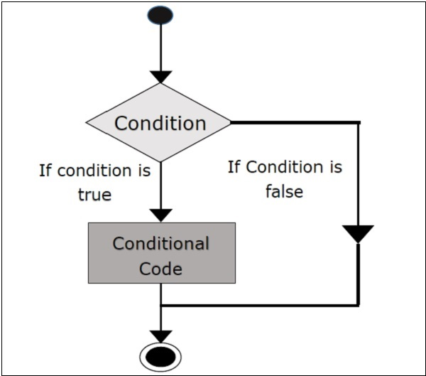
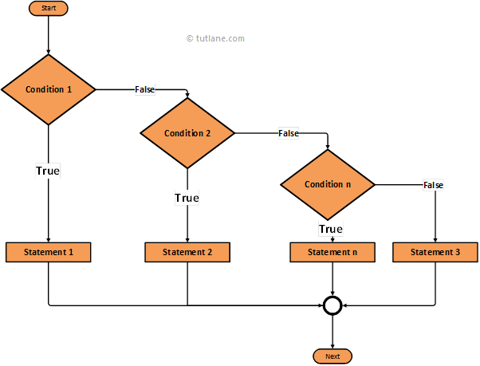
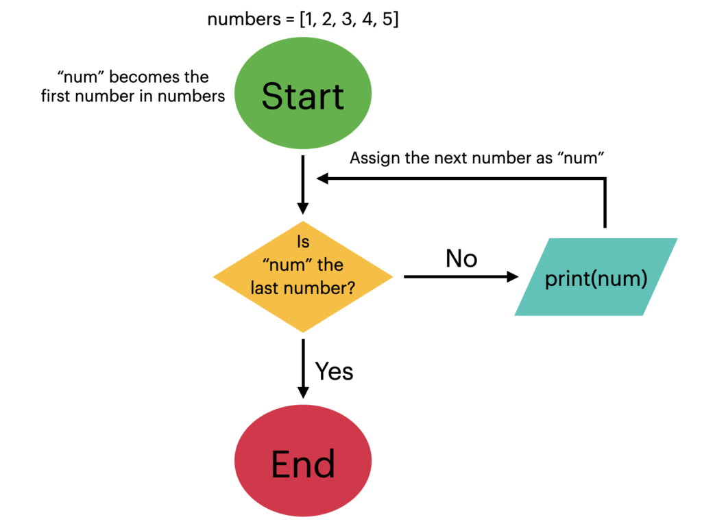

## Topic

In this session, we will discuss:

  * 6 Control structures: loops and conditions
  * 6.1 if, else and for
  * 6.2 Vectorised code
  * 6.3 Further Reading


## keywords & Notes

### 6. Control structures: loops and conditions

In this session, we learn how to make R think and repeat.

You’ll explore two important programming ideas:

  1. **Conditions** — making decisions in your code (for example, using `if` statements).

  2. **Loops** — repeating tasks automatically (for example, using `for` or `while` loops).

>[!NOTE]
> These tools help you control how your code runs, so you can tell R:
> * 👉 “If this happens, do that,” or
> * 👉 “Do this action several times.”

📘 To get started, read Chapter [13.1 and 13.2 from R Programming for Data Science](https://bookdown.org/rdpeng/rprogdatascience/control-structures.html).
They give a beginner-friendly introduction to how loops and conditions work in R.

* 13 Control Structures
* 13.1 if-else
* 13.2 for Loops
* 13.3 Nested for loops
* 13.4 while Loops
* 13.5 repeat Loops
* 13.6 next, break
* 13.7 Summary

#### 13 Control Structures
[Watch a video of this section](https://www.youtube.com/watch?v=BPNLjUDZ8_o)

Control structures in R let us control how and when code runs.

Instead of executing everything in order, we can tell R to make decisions or repeat actions based on certain conditions.

They bring logic into our code — allowing it to respond to inputs or data patterns.

Common control structures include:

 * `if / else` – test a condition and decide what to do.
 * `for` – repeat something a fixed number of times.
 * `while` – keep repeating as long as a condition is true.
 * `repeat` – run continuously until you manually stop it with `break`.
 * `break` – stop a loop early.
 * `next` – skip the current loop step and move to the next one.
 * `return` - exit the function
  
  

>[!NOTE]
> These are mostly used when writing `functions` or `longer scripts`, but it’s important to understand them early — they make your R programs dynamic and intelligent.

>[TIP]
> To clear all variables from your R environment (that is, remove everything currently stored in memory), you can use this simple command:

```
rm(list = ls())

```
> 💡 Explanation:
> * `ls()` → lists all the variable names currently in your environment
> * `rm()` → removes them
> * `list = ls()` → tells R to remove everything listed by ls()
> * rm(list = ls()) -This does not delete files from your computer — it only clears the variables from R’s active memory.

##### 13.1 if-else

[Watch a video of this section](https://www.youtube.com/watch?v=ZaBtJPYYGwg)

The `if–else` statement helps R make decisions — it checks a condition and decides what to do depending on whether that condition is `TRUE` or `FALSE`.

🪜 Basic if statement

If a condition is `true`, R runs the code inside the `{ }`.

If it’s `false`, R simply `skips` it.

```
x <- 5

if (x > 3) {
  print("x is greater than 3")
}

```

🟢 Output:

```
[1] "x is greater than 3"

```
> If `x` was less than or equal to 3, nothing would happen.


🪜 `if` with `else`

If you want R to do something `else` when the condition is false, add an `else block`:

```
x <- 2

if (x > 3) {
  print("x is greater than 3")
} else {
  print("x is not greater than 3")
}


```

🟢 Output:

```
[1] "x is not greater than 3"

```



🪜 Multiple Conditions (`else if`)

You can check more than one condition using `else if`:

```
x <- 5

if (x > 8) {
  print("x is big")
} else if (x > 3) {
  print("x is medium")
} else {
  print("x is small")
}
```

🟢 Output:

```
[1] "x is medium"

```



🧮 Example: Using random numbers

```
# Generate a random number between 0 and 10
x <- runif(1, 0, 10)

if (x > 3) {
  y <- 10
} else {
  y <- 0
}

print(c(x, y))

```
> Here,
> * If `x > 3`, then y becomes 10
> * Otherwise, `y` becomes `0`

You can also write this in a shorter form:

```
y <- if (x > 3) 10 else 0

```
> Both ways are correct — choose whichever is easier for you to read.

>[TIP]
> You can have multiple separate `if` statements if you want to check several unrelated conditions — they will all be tested individually:

```
if (x > 3) {
  print("x is greater than 3")
}

if (x < 8) {
  print("x is less than 8")
}

```
> [!TIP]
> Use `if`, `else if`, and `else` to make your code smart and responsive to data conditions.

##### 13.2 for Loops

[Watch a video of this section](https://www.youtube.com/watch?v=FbT1dGXCCxU)

A `for loop` is used in R when you want to repeat a task multiple times — like printing numbers, processing data, or performing calculations.

It’s one of the most common ways to automate repetitive work in R.


🧠 **Basic idea**

A `for loop` takes a variable (called `the iterator`) and gives it one value at a time from a `sequence or vector` — then runs the code inside `{}` for each value.



```
for (i in 1:10) {
  print(i)
}

```
🟢 Output:

```
[1] 1
[1] 2
[1] 3
[1] 4
[1] 5
[1] 6
[1] 7
[1] 8
[1] 9
[1] 10

```

> Here:
> * `i` is the iterator (it changes each time)
> * `1:10` means the numbers 1 to 10
> * The loop repeats `10` times, printing each number

💬 Example: Looping through a character vector

Let’s say we have a list of letters:

```
x <- c("a", "b", "c", "d")

for (i in 1:4) {
  print(x[i])
}

```

🟢 Output:

```
[1] "a"
[1] "b"
[1] "c"
[1] "d"

```
> This prints each element of the vector `x`.

🧩 **Using `seq_along()` (a safer method)**

If you don’t know how long your vector is, use `seq_along()` — it automatically adjusts to the vector’s length.

```
x <- c("a", "b", "c", "d")

for (i in seq_along(x)) {
  print(x[i])
}

```

> Same result, but more flexible — it works even if `x` has `100` elements.

🔤 **Looping directly over elements**

You don’t always need an index number `(i)`.

You can loop directly over the elements:

```
for (letter in x) {
  print(letter)
}


```

🟢 Output:

```
[1] "a"
[1] "b"
[1] "c"
[1] "d"

```

🪶 **One-line loops**
If your loop only has one line of code, you can write it without `{}` — but it’s good practice to always include them:

```
for (i in 1:4) print(x[i])

for(element in x) print(element)
```

>[!TIP]
> Tip for beginners:
> * Think of for loops as “do this for each item”.
> * They help you save time and avoid repeating the same code many times.

##### 13.3 Nested for loops

A `nested for loop` means putting one `for loop` inside another.

This helps when working with data that has `rows` and `columns` — like a `matrix` or `table` — or with multi-level (hierarchical) data such as lists within lists.

🧠 *Example: Looping through a Matrix*

Let’s start with a simple matrix — a grid of numbers with rows and columns.

```
# Create a 2x3 matrix (2 rows, 3 columns)
x <- matrix(1:6, 2, 3)

print(x)


```
🟢 Output:

```
     [,1] [,2] [,3]
[1,]    1    3    5
[2,]    2    4    6

```
Now we’ll use nested for loops to print each value inside the matrix.

```
for (i in seq_len(nrow(x))) {       # Loop through rows
  for (j in seq_len(ncol(x))) {     # Loop through columns
    print(x[i, j])                  # Print each element
  }   
}

```

🟢 Output:

```
[1] 1
[1] 3
[1] 5
[1] 2
[1] 4
[1] 6

```

> Here’s what happens step by step:
> 1. The outer loop (`i`) moves across the rows.
> 2. For each row, the inner loop (`j`) goes through all columns.
> 3. `x[i, j]` selects the element in row `i` and column `j`.
> So the code prints every value in the matrix, one by one.

>[!CAUTION]
> While nested loops are powerful, too many levels (more than 2–3) make code hard to read and maintain.
> If your code needs many nested loops, it’s often better to:
> * Break it into smaller functions, or
> * Use vectorized functions (which perform operations on whole vectors or matrices at once — much faster and cleaner).


In simple terms:
> Nested loops are like reading a table —  
> * The outer loop moves row by row,  
> * and the inner loop moves column by column inside each row.  


